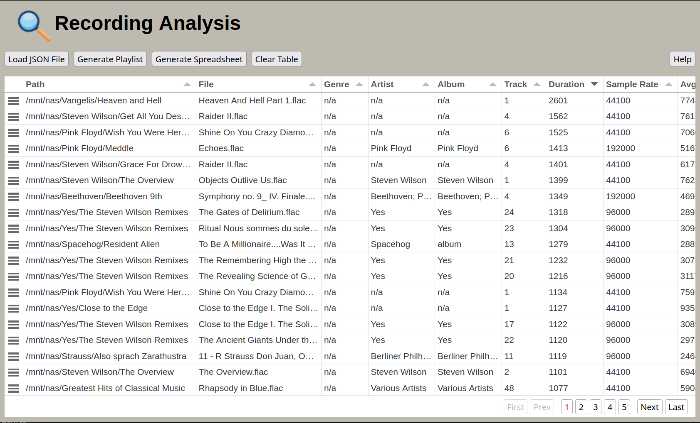

# README


This website is associated with the recording-analyzer tool, a tool for analyzing objective characteristics of audio files.
See the README at <https://github.com/mcochris/Recording-analyzer> for more information about the recording-analyzer program.

The recording-analyzer program has an option to output the statistics it generates to the JSON data format. The user can upload
the JSON file to this website via the "Load JSON file" button.



## 🏁 Getting started

- To use this site, a JSON file must be generated by recording-analyzer using the --json flag. Example:

```text
recording-analyzer --metadata --json /home/chris/Music > myMusic.json
```

- You would then come to this website and upload the myMusic.json file.

## 🚀 Features

- Each column of the table can be sorted by clicking the column header.
- You can sort by a second (or third, fourth, etc) column by holding down the ctrl key and clicking the other column header.
- Columns can be moved by clicking and dragging the column to a new position.
- Rows can be moved by clicking and dragging the three line icon in the table's first column to a new position.
- Rows can be selected by clicking them.
- Adjacent rows can be selected by clicking on the first row you want selected, holding down the shift button on your keyboard,
then clicking on the last row you want selected.
- Non-adjacent rows can be selected by clicking on the first row you want selected, holding down the ctrl button on your keyboard,
and selecting other rows. Continue holding down the ctrl button and select as many rows as you want.

## 📥 Load JSON File

- Click this button to open a file picker and select your JSON file. Select only one JSON file.

## 🎶 Generate Playlist

- You can generate a .m3u8 playlist by selecting the rows you want to include in the playlist. This playlist can be opened in media players such as VLC or foobar2000 to queue up your selected recordings. See the Adjacent and non-adjacent
row selection notes above for help selecting rows.
- After you are done selecting the rows you want, click the "Generate Playlist" button and a download of "playlist.m3u"
will begin shortly.

## 📄 Generate Spreadsheet

- You can generate an .ods spreadsheet of the entire dataset you uploaded by clicking the "Generate Spreadsheet" button.
Any column sorting, column moves and row moves are not preserved when the spreadsheet is generated.  A download of "recordings.ods"
will begin shortly.

## 🧹 Clear Table

- The clear data button will empty the contents of the table, clear sorting and any row or column selections, then reload the page.

## ❓ Browser compatibility

- Supported on the latest versions Firefox, Chrome, and Edge as of March 2026. Compatibility unknown on other browsers or previous
versions of the supported browsers.

## 💬 Feedback

Comments, questions, and suggestions are welcome. You can open an issue here: <https://github.com/mcochris/recording-analyzer-webpage/issues>
